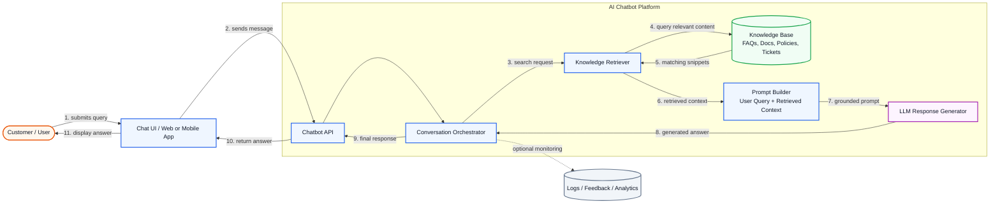

# Customer Support AI Chatbot - System Architecture

## Flow

1. The customer submits a support query through the chat UI.
2. The chatbot API passes the message to the conversation orchestrator.
3. The orchestrator searches the knowledge base through a retriever component.
4. Relevant FAQ/document/ticket snippets are returned.
5. The prompt builder combines the user query with retrieved context.
6. The LLM generates a grounded customer-support response.
7. The answer is returned through the API and displayed to the customer.
